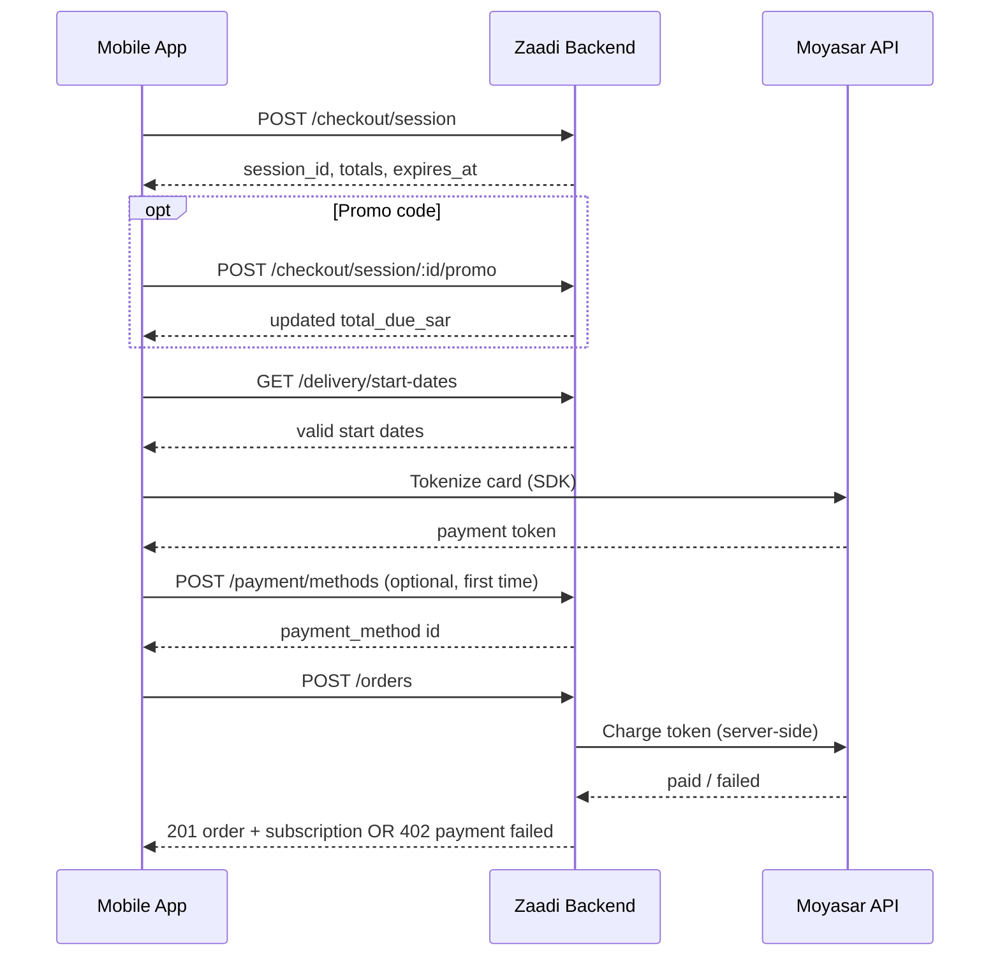

# Payment Integration — Frontend Handover

**Audience:** Mobile / frontend engineers  
**Backend base URL:** `{API_HOST}/api/v1`  
**Auth:** All endpoints below require `Authorization: Bearer <access_token>` unless noted.  
**Swagger:** `{API_HOST}/api` (interactive API docs)  
**Last updated:** March 2026

---

## 1. Overview

Zaadi Kitchen checkout is a **server-driven payment flow**:

1. User selects a plan → backend creates a **checkout session** (10-minute TTL).
2. User optionally applies a promo/referral code → backend recalculates totals.
3. User picks a **delivery start date** and **payment method**.
4. Frontend obtains a **Moyasar payment token** (card / Apple Pay / STC Pay via Moyasar SDK).
5. Frontend saves the token (or reuses a saved method) → calls **`POST /orders`**.
6. Backend charges Moyasar, then creates **order + subscription + delivery schedule** in one step.



**Important:** The backend charges Moyasar **server-side**. The app must **not** call Moyasar charge APIs directly for subscription checkout — only tokenization runs on the client.

---

## 2. Environments

| Environment | Backend | Moyasar | Notes |
|-------------|---------|---------|-------|
| Local dev (mock) | `http://localhost:3000` | Not used | `USE_MOCK_PAYMENT=true` on backend — any token works with hardcoded method IDs |
| Staging / QA | Staging API URL | **Sandbox** (`sk_test_…` on backend) | Use Moyasar test cards / test Apple Pay |
| Production | Production API URL | **Live** (`sk_live_…` on backend) | Real charges |

**Frontend needs:**

- Moyasar **publishable** key (from Moyasar dashboard) for client-side tokenization — configure per environment in the app, not from this backend repo.
- Backend team provides API base URL + JWT from OTP login.

**Backend env (for reference — not needed in the app):**

```bash
USE_MOCK_PAYMENT=false          # true = mock gateway, no real Moyasar call
MOYASAR_API_KEY=sk_test_...     # server secret; never embed in the app
```

---

## 3. End-to-end API flow

### Step 0 — Prerequisites

Before checkout, ensure:

- User is authenticated (JWT).
- User has a **primary delivery location** saved (`GET /users/delivery-location`).
- For returning users, optionally load plans with wallet: `GET /plans/active`.

### Step 1 — Load plans (Plan Selection screen)

```http
GET /api/v1/plans/active
```

**Response (200):**

```json
{
  "plans": [
    {
      "id": "month",
      "name": "Month Plan",
      "price_sar": 500,
      "meal_count": 22,
      "price_per_meal_sar": 22.7,
      "skip_days_allowed": 66,
      "pause_days_allowed": 66,
      "is_most_popular": true,
      "is_last_plan": true
    }
  ],
  "wallet_balance_sar": 50
}
```

**Plan IDs:** `try_it` · `week` · `month` · `quarterly`

| Plan | Price (SAR) | Meals |
|------|-------------|-------|
| try_it | 28 | 1 |
| week | 125 | 5 |
| month | 500 | 22 |
| quarterly | 1300 | 66 |

Use `is_last_plan` for the “Your Last Plan” badge (returning users).  
`wallet_balance_sar` is auto-applied at session creation (returning users only; backend handles math).

---

### Step 2 — Create checkout session (enter Payment screen)

```http
POST /api/v1/checkout/session
Content-Type: application/json

{
  "plan_id": "month",
  "meal_type": "executive"
}
```

**`meal_type`:** `executive` | `salad` (same price).

**Response (201):**

```json
{
  "session_id": "550e8400-e29b-41d4-a716-446655440000",
  "plan_id": "month",
  "meal_type": "executive",
  "base_price_sar": 500,
  "wallet_credit_sar": 50,
  "promo_discount_sar": 0,
  "total_due_sar": 450,
  "promo_code": null,
  "promo_attempt_count": 0,
  "promo_locked": false,
  "expires_at": "2026-09-17T10:51:00.000Z"
}
```

**UI rules:**

- Show a **10-minute countdown** from `expires_at`.
- Creating a new session **expires** any previous active session for the user.
- **Pricing order:** `total_due_sar = base_price_sar - wallet_credit_sar - promo_discount_sar` (floor at 0).

**Poll / refresh session:**

```http
GET /api/v1/checkout/session/:session_id
```

Same shape as create response. Returns **410** if expired.

> **Note:** `GET` may return `plan_id` as internal UUID in some builds; rely on the slug from `POST /checkout/session` for display. Use `session_id` as the source of truth for checkout.

---

### Step 3 — Promo / referral code (optional)

**Optional pre-validation (instant feedback while typing):**

```http
POST /api/v1/referrals/validate
Content-Type: application/json

{
  "code": "AHMED15",
  "plan_id": "month"
}
```

**Valid (200):**

```json
{
  "valid": true,
  "code": "AHMED15",
  "discount_type": "referral",
  "discount_sar": 100,
  "discount_pct": 20,
  "description": "Referral discount"
}
```

**Invalid (200 with `valid: false`):**

```json
{
  "valid": false,
  "error_code": "INVALID_CODE",
  "message": "This code doesn't exist or has already been used."
}
```

| `error_code` | Meaning | UI |
|--------------|---------|-----|
| `INVALID_CODE` | Unknown or exhausted code | Inline error |
| `CODE_ALREADY_USED` | User already redeemed this code | Inline error |
| `NOT_NEW_USER` | Referral on returning user | Inline error |
| `PLAN_MISMATCH` | Code not valid for selected plan | Inline error |

**Apply code to session (required before Pay if user applied a code):**

```http
POST /api/v1/checkout/session/:session_id/promo
Content-Type: application/json

{ "code": "AHMED15" }
```

**Response (200):**

```json
{
  "session_id": "...",
  "promo_code": "AHMED15",
  "discount_type": "referral",
  "promo_discount_sar": 100,
  "total_due_sar": 350,
  "promo_attempt_count": 1,
  "promo_locked": false
}
```

**Remove code:**

```http
DELETE /api/v1/checkout/session/:session_id/promo
```

**Promo errors (HTTP error body):**

| Status | `errorCode` | When |
|--------|-------------|------|
| 422 | `INVALID_CODE` | Bad code (includes `details.promo_attempt_count`) |
| 423 | `PROMO_LOCKED` | Too many failed attempts — disable promo field |
| 422 | `NOT_NEW_USER` | Referral on returning user |
| 422 | `PLAN_MISMATCH` | Wrong plan scope |
| 410 | `SESSION_EXPIRED` | Session TTL passed |

Failed attempts lock after **5** invalid tries (not 10).

---

### Step 4 — Delivery start date

```http
GET /api/v1/delivery/start-dates?limit=14
```

Optional query: `from=YYYY-MM-DD` (must be ≥ tomorrow).

**Response (200):**

```json
{
  "start_dates": [
    {
      "date": "2026-09-22",
      "label": "Monday, 22 Sep 2026",
      "is_next_working_day": true,
      "is_available": true
    },
    {
      "date": "2026-09-26",
      "label": "Friday, 26 Sep 2026",
      "is_next_working_day": false,
      "is_available": false,
      "unavailable_reason": "Non-working day"
    }
  ]
}
```

**Rules:**

- Working days: **Sunday–Thursday** only.
- Pre-select the date where `is_next_working_day: true`.
- Pass chosen `date` as `start_date` in `POST /orders`.

---

### Step 5 — Payment methods

#### List methods (Payment screen)

```http
GET /api/v1/payment/methods
```

**Response (200):**

```json
{
  "payment_methods": [
    {
      "id": "00000000-0000-0000-0000-000000000001",
      "type": "mada",
      "label": "Mada",
      "is_default": true,
      "is_last_used": false
    },
    {
      "id": "00000000-0000-0000-0000-000000000002",
      "type": "visa",
      "label": "Visa",
      "is_default": false,
      "is_last_used": false
    },
    {
      "id": "00000000-0000-0000-0000-000000000003",
      "type": "apple_pay",
      "label": "Apple Pay",
      "is_default": false,
      "is_last_used": false
    }
  ]
}
```

**Supported types:** `mada` · `visa` · `mastercard` · `stc_pay` · `apple_pay`

> **Current limitation:** This endpoint returns **hardcoded placeholder methods** for UI development. User-saved cards from `POST /payment/methods` are stored in the DB but **not yet merged** into this list. For production Moyasar flow, save the card first (below) and use the returned `id` in `POST /orders`.

#### Save a tokenized method (after Moyasar SDK tokenization)

```http
POST /api/v1/payment/methods
Content-Type: application/json

{
  "type": "mada",
  "token": "tok_xxxxxxxx"
}
```

**Response (201):**

```json
{
  "id": "pm-uuid-from-db",
  "type": "mada",
  "label": "Mada ····0000",
  "is_default": false,
  "is_last_used": false
}
```

Use this `id` as `payment_method_id` in `POST /orders`.

#### Remove a saved method

```http
DELETE /api/v1/payment/methods/:method_id
```

**Response:** `204 No Content`

---

### Step 6 — Pay (`POST /orders`)

This is the **Pay** button action.

```http
POST /api/v1/orders
Content-Type: application/json

{
  "session_id": "550e8400-e29b-41d4-a716-446655440000",
  "payment_method_id": "pm-uuid-from-db",
  "start_date": "2026-09-22"
}
```

| Field | Required | Format |
|-------|----------|--------|
| `session_id` | Yes | From checkout session |
| `payment_method_id` | Yes | From `POST /payment/methods` or hardcoded dev IDs |
| `start_date` | Yes | `YYYY-MM-DD`, must be an available working day |

**Do not send:** `paymentToken`, `checkoutSessionId`, or camelCase variants — the API uses **snake_case** only.

**Success (201):**

```json
{
  "order_id": "ord-uuid",
  "subscription_id": "sub-uuid",
  "status": "confirmed",
  "is_new_user": true,
  "plan_id": "month",
  "meal_type": "executive",
  "meal_count": 22,
  "start_date": "2026-09-22",
  "first_delivery_label": "Monday, 22 Sep",
  "summary": {
    "plan_price_sar": 500,
    "wallet_credit_sar": 50,
    "promo_discount_sar": 100,
    "promo_code": "AHMED15",
    "discount_label": "Referral discount",
    "total_paid_sar": 350
  }
}
```

**Success screen routing:**

| Field | Use |
|-------|-----|
| `is_new_user: true` | “Your first Zaadi meal!” success variant |
| `is_new_user: false` | “You’re back!” + receipt link |
| `first_delivery_label` | First delivery date copy |
| `summary.total_paid_sar` | Amount charged (after wallet + promo) |

**What backend does on success:**

1. Charges Moyasar for `total_due_sar` (from session, not re-sent by client).
2. Creates order + active subscription.
3. Generates delivery days (Sun–Thu, skips holidays).
4. Debits wallet if `wallet_credit_sar > 0`.
5. Credits referrer (10% of **full plan price**) if referral code was applied.

---

### Step 7 — Receipt (optional)

```http
GET /api/v1/orders/:order_id
```

**Response (200):** Full receipt with `summary`, `payment_method`, `created_at`.

---

### Step 8 — Post-purchase verification

```http
GET /api/v1/subscriptions/me
GET /api/v1/subscriptions/me/deliveries
GET /api/v1/users/wallet/transactions
```

Use these to confirm active subscription and wallet ledger after pay.

---

## 4. Moyasar integration (frontend responsibilities)

### 4.1 What the app must do

1. Integrate **Moyasar mobile/web SDK** with your **publishable key**.
2. Collect payment details → obtain a **one-time token** (`tok_…`).
3. Send token to backend via `POST /payment/methods` (recommended) OR use a saved method id on renewal.
4. Call `POST /orders` — backend performs the charge.

### 4.2 What the backend does

- Converts SAR → **halalas** (`amount × 100`).
- `POST https://api.moyasar.com/v1/payments` with:

```json
{
  "amount": 35000,
  "currency": "SAR",
  "description": "Month Plan · 2026-09-22",
  "source": { "type": "token", "token": "<stored_token>" },
  "metadata": { "orderId": "<payment_transaction_uuid>" }
}
```

- Treats `paid`, `captured`, and `authorized` as success.

### 4.3 Payment method matrix

| Method | Client tokenization | Save via API | Notes |
|--------|--------------------|--------------|-------|
| Mada / Visa / MC | Moyasar card form | `POST /payment/methods` | Standard flow |
| Apple Pay | Moyasar Apple Pay | `POST /payment/methods` with `type: apple_pay` | Device-native |
| STC Pay | Moyasar STC Pay flow | `POST /payment/methods` with `type: stc_pay` | Follow Moyasar STC docs |

### 4.4 Local development (mock gateway)

When backend runs with `USE_MOCK_PAYMENT=true`:

- Hardcoded method IDs work without real Moyasar tokens:

| ID | Type |
|----|------|
| `00000000-0000-0000-0000-000000000001` | mada |
| `00000000-0000-0000-0000-000000000002` | visa |
| `00000000-0000-0000-0000-000000000003` | apple_pay |

- `POST /orders` always succeeds without calling Moyasar.

---

## 5. Error handling

All domain errors return JSON:

```json
{
  "statusCode": 402,
  "errorCode": "PAYMENT_FAILED",
  "message": "Your payment could not be processed. Please check your card details and try again.",
  "operation": "create-order"
}
```

### Payment / checkout errors

| HTTP | `errorCode` | When | Frontend action |
|------|-------------|------|-----------------|
| 402 | `PAYMENT_FAILED` | Moyasar declined | Show inline error on payment screen; allow retry |
| 410 | `SESSION_EXPIRED` | Checkout TTL exceeded | Navigate back to plan selection; create new session |
| 404 | `RESOURCE_NOT_FOUND` | Bad session or payment method id | Refresh session / re-save card |
| 400 | `VALIDATION_ERROR` | Invalid body (e.g. bad `start_date` format) | Fix input |
| 422 | `INVALID_CODE` | Bad promo | Show under promo field |
| 423 | `PROMO_LOCKED` | Too many promo attempts | Disable promo input |
| 422 | `NOT_NEW_USER` | Referral on returning user | Show invalid referral message |
| 401 | `AUTHENTICATION_ERROR` | Expired JWT | Refresh token or re-login |

**On `PAYMENT_FAILED`:** No subscription is created. User can retry Pay with the **same session** if it has not expired.

**On `SESSION_EXPIRED`:** User must `POST /checkout/session` again (plan selection may be preserved in UI state).

---

## 6. Business rules (product reference)

Aligned with master product docs (`docs/master/`):

| Rule | Implementation |
|------|----------------|
| Full plan price upfront | `base_price_sar` from plan |
| Promo / referral 20% off | Referral: 20% of plan price; applied via session promo |
| Referral: new users only | Returning users get `NOT_NEW_USER` |
| Wallet auto-applied | At session create; returning users only |
| Charge order | Discount → wallet → charge remainder (`total_due_sar`) |
| Working week Sun–Thu | Enforced in start-dates + delivery generation |
| No auto-renewal | Renewal = repeat full checkout flow |
| Referrer reward | 10% of plan price credited to referrer on successful pay |

---

## 7. UI screen → API mapping

| Screen (master doc) | APIs |
|---------------------|------|
| Plan Selection | `GET /plans/active` |
| Payment — order summary | `POST /checkout/session`, `GET /checkout/session/:id` |
| Payment — promo field | `POST /referrals/validate`, `POST /checkout/session/:id/promo`, `DELETE .../promo` |
| Payment — start date picker | `GET /delivery/start-dates` |
| Payment — method selector | `GET /payment/methods` + Moyasar SDK |
| Payment — Pay button | `POST /orders` |
| Success | Response body + `GET /orders/:id` for receipt |
| Billing / wallet history | `GET /users/wallet/transactions` |

---

## 8. Known gaps & coordination items

Track these with backend before production sign-off:

| Item | Impact on frontend |
|------|-------------------|
| **No payment webhook** | If app crashes after Moyasar succeeds but before 201, user may be charged without subscription — rare; backend reconciliation TBD |
| **`GET /payment/methods` hardcoded** | Saved cards not listed yet — may need to cache `POST /payment/methods` response locally until fixed |
| **`total_due_sar = 0`** (wallet covers all) | Backend still calls Moyasar with amount 0 — test edge case with backend |
| **Postman collection outdated** | `POST /orders` body in mobile Postman uses wrong field names — use this doc |
| **No client-side Moyasar publishable key in backend** | Frontend owns Moyasar dashboard keys per environment |

---

## 9. Quick test checklist (QA)

- [ ] New user: Month plan, no code → pay → `is_new_user: true`, active subscription
- [ ] Returning user: wallet line in session totals
- [ ] Referral code (new user): 20% off + lower `total_due_sar`
- [ ] Referral code (returning user): rejected
- [ ] Session expiry after 10 min → 410 on pay
- [ ] Declined card → 402, no subscription
- [ ] Success → `GET /subscriptions/me` shows active plan
- [ ] Moyasar sandbox: real token → charge appears in Moyasar dashboard

---

## 10. Reference files (backend repo)

| Topic | Path |
|-------|------|
| Checkout controller | `src/gateways/http/checkout.controller.ts` |
| Orders / Pay | `src/gateways/http/orders.controller.ts` |
| Payment methods | `src/gateways/http/payment.controller.ts` |
| Create order use case | `src/core/usecases/commands/CreateOrder.ts` |
| Moyasar gateway | `src/infrastructure/MoyasarPayment/moyasar-payment-gateway.service.ts` |
| Implementation guide | `docs/plan_payment_subscription_implementation.md` |
| Product master docs | `docs/master/` |

---

## 11. Contact / questions

For API bugs or contract changes, share:

- Request: method, path, body, `Authorization` header (redacted)
- Response: status, full JSON body
- `session_id` / `order_id` if applicable
- Environment (local / staging / prod) and whether mock or live Moyasar
