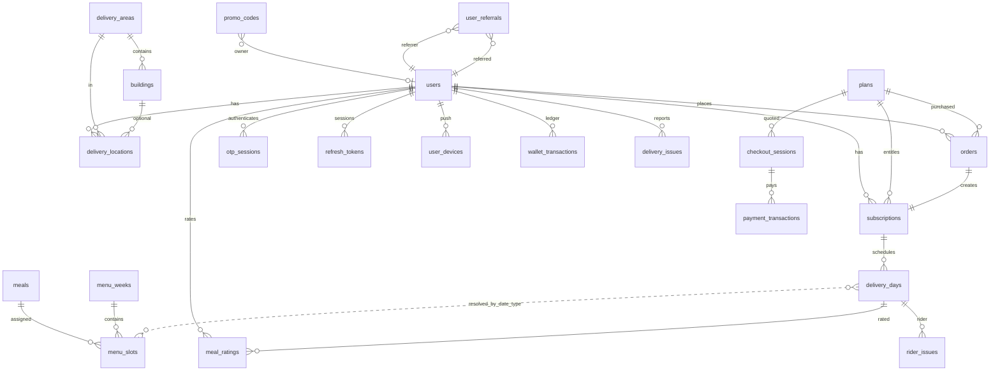
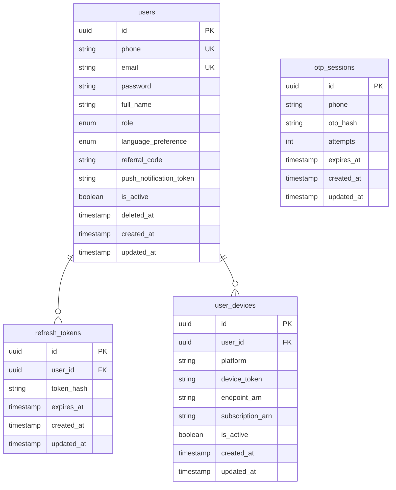
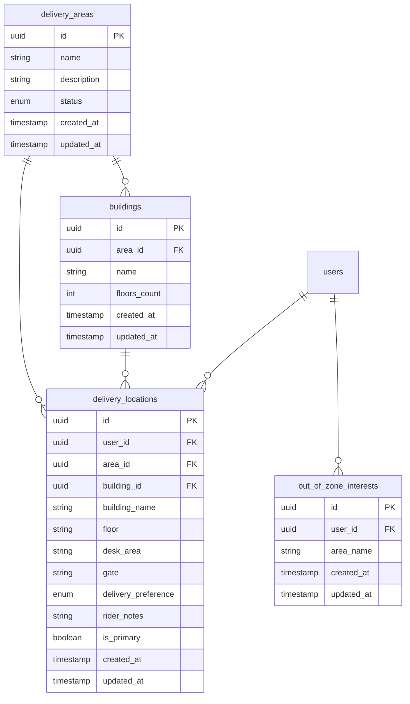
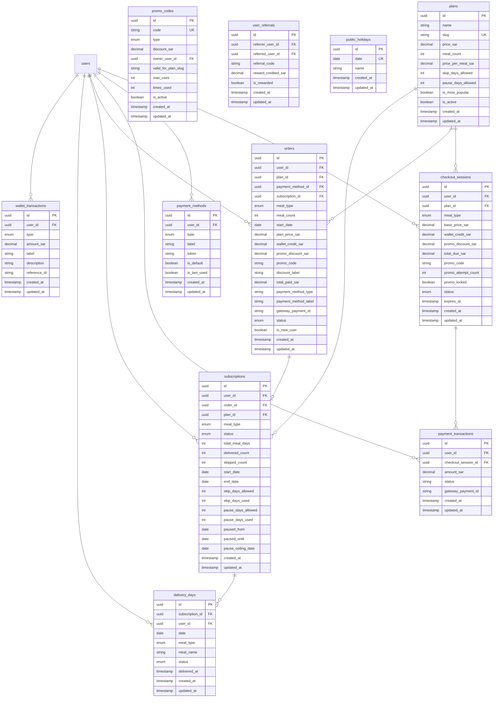
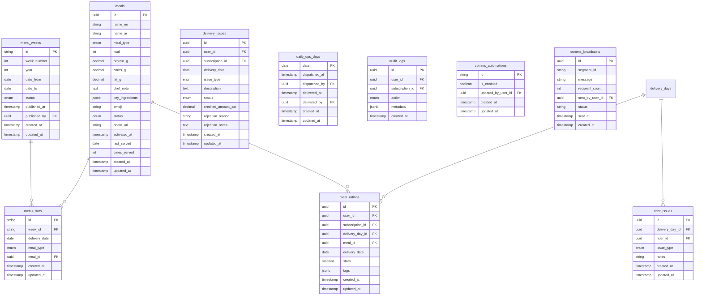

# Zaadi Kitchen — Database Design

**Engine:** PostgreSQL 14+  
**Naming:** `snake_case` columns, UUID primary keys (except `menu_weeks.id`, `menu_slots.id`, `comms_automations.id`)  
**Timestamps:** `created_at`, `updated_at` on most tables (UTC)

---

## 1. Domain overview

The schema supports four main concerns:

1. **Identity & access** — users, OTP sessions, refresh tokens, devices  
2. **Delivery geography** — areas, buildings, customer delivery locations  
3. **Commerce** — plans, checkout, payments, orders, subscriptions, wallet, referrals  
4. **Fulfillment & menu** — meals, weekly menu slots, per-day delivery schedule, ratings, issues, daily ops  

---

## 2. High-level ER diagram

---

## 3. Detailed ER — identity & auth

**`users.role`:** `CUSTOMER` | `DRIVER` | `ADMIN` | `OPS`  
**Soft delete:** `deleted_at` set when a customer deletes their account (PII anonymized; row retained for audit).

---

## 4. Detailed ER — delivery geography

**`delivery_areas.status`:** `active` | `coming_soon` | `paused`  
**`delivery_preference`:** `hand_to_me` | `reception`

---

## 5. Detailed ER — plans, checkout, subscription

**`subscriptions.status`:** `active` | `paused` | `cancelled` | `expired`  
**`delivery_days.status`:** `scheduled` | `skipped` | `delivered` | `past_cutoff` | `paused`  
**`checkout_sessions.status`:** `active` | `expired` | `confirmed`  
**`orders.status`:** `pending` | `confirmed` | `failed`

Meal assignment for a delivery day is derived from **`menu_slots`** (date + `meal_type`), not only `delivery_days.meal_name`.

---

## 6. Detailed ER — menu, ratings, operations

**`meals.status`:** `draft` | `active`  
**`menu_weeks.status`:** `draft` | `published` | `past`  
**`menu_weeks.id` format:** e.g. `w2026-38` (ISO week–based string)  
**`menu_slots`:** unique on `(week_id, delivery_date, meal_type)`  
**`delivery_issues.status`:** `open` | `credited` | `rejected`  
**`audit_logs.action`:** includes `skip_delivery`, `pause_subscription`, `delete_account`, etc.

---

## 7. Table index (alphabetical)

| Table | Description |
|-------|-------------|
| `audit_logs` | Subscription lifecycle actions for support and compliance |
| `buildings` | Admin-curated building names per delivery area |
| `checkout_sessions` | Short-lived checkout quote before order placement |
| `comms_automations` | Toggle for automated push notification types |
| `comms_broadcasts` | Admin broadcast send history |
| `daily_ops_days` | Per-date dispatch/delivered pipeline timestamps |
| `delivery_areas` | Service zones (active / coming soon / paused) |
| `delivery_days` | One row per subscription calendar delivery day |
| `delivery_issues` | Customer-reported delivery problems |
| `delivery_locations` | Saved addresses for customers |
| `meal_ratings` | Star ratings and tags per delivered day |
| `meals` | Meal catalog (macros, photo, chef notes) |
| `menu_slots` | Meal assigned to a date + type within a week |
| `menu_weeks` | Weekly menu container (publish workflow) |
| `orders` | Payment record linked to plan purchase |
| `otp_sessions` | OTP verification state |
| `out_of_zone_interests` | Lead capture when area not in service |
| `payment_methods` | Tokenized payment methods per user |
| `payment_transactions` | Gateway payment attempts per checkout |
| `plans` | Subscription plan definitions |
| `promo_codes` | Promo and referral discount codes |
| `public_holidays` | Non-delivery dates |
| `refresh_tokens` | JWT refresh token storage |
| `rider_issues` | Driver-reported delivery blockers |
| `subscriptions` | Active entitlement and skip/pause counters |
| `user_devices` | SNS endpoints for mobile push |
| `user_referrals` | Referrer ↔ referred linkage and rewards |
| `users` | All personas (customer, driver, admin, ops) |
| `wallet_transactions` | Wallet credit/debit ledger |

---

## 8. Key business rules (data layer)

| Rule | Implementation |
|------|----------------|
| One active subscription per customer | Enforced in application layer when creating subscriptions |
| One rating per user per delivery day | Unique index on `meal_ratings (user_id, delivery_day_id)` |
| Skip/pause limits | Copied from `plans` onto `subscriptions`; usage on `skip_days_used` / `pause_days_used` |
| Menu visibility | Customer APIs read **published** `menu_weeks` only |
| Building list | `GET /delivery/areas/:id/buildings` returns buildings for any existing area status; saving a location still requires an **active** area |
| Account deletion | `users.deleted_at` + anonymization; related tokens/locations removed per policy |

---

## 9. Migrations source of truth

Schema changes are applied via Sequelize migrations:

`src/infrastructure/SequelizePersistence/migrations/`

Deploy order is by filename timestamp. New environments run `npx sequelize-cli db:migrate`.

---

## 10. Related assets

- **Meal photos:** S3 keys `meals/{meal_id}/photo.{jpeg|png|webp}`; public URL stored in `meals.photo_url` when uploaded  
- **No separate read replicas** documented in code; single PostgreSQL primary assumed
