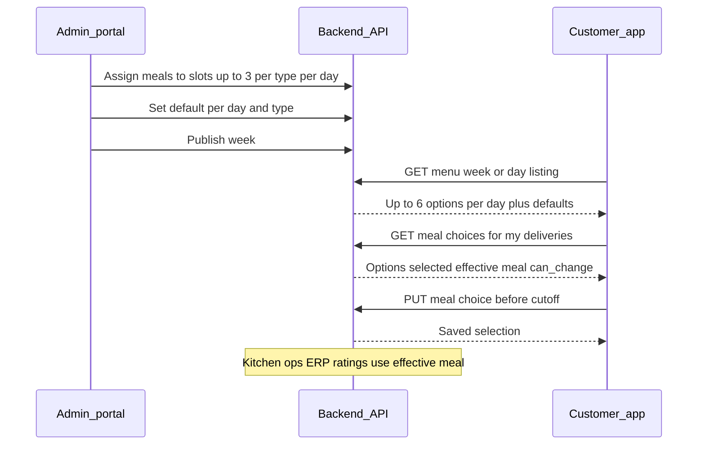

# Meal options proposal — up to 3 Executive + 3 Salad per day

**Status:** Proposal (not yet built)  
**Audience:** Client product, admin portal team, mobile app team, QA  
**Last updated:** October 2026  
**Related:** [API_REFERENCE.md](./API_REFERENCE.md) (will be updated when this ships)

---

## 1. What we are proposing (plain English)

Today, for each working day (Sunday–Thursday), the kitchen publishes **one Executive dish** and **one Salad dish**. Every customer on Executive gets that one dish; every customer on Salad gets the other.

**New behaviour:**

- Admin can publish **up to three Executive meals** and **up to three Salad meals** per day (minimum **one** of each type if that type is offered that day).
- For each day and meal type, admin marks **one option as the default**. If a customer never picks a dish, they receive the **default** for their meal type that day.
- Customers with an active subscription can **choose which dish they want** for each upcoming delivery day, but only from the options for **their meal type that day** (Executive **or** Salad — same rules as today’s “switch meal type”, not two deliveries per day).
- Choice must be made **before 6:00 PM Saudi time on the day before delivery** — the same cutoff used for skip and meal-type changes.
- If only **one** dish is published for that type on that day, the app can show it as selected automatically; no extra tap required.

**What does not change:**

- Subscription plans, pricing, skip/pause/cancel, and **switch meal type** (Executive vs Salad) stay as today.
- No “upgrade/downgrade” between plan tiers.
- No second delivery per day (still one meal per delivery day per customer).
- ERP still receives **one line per customer per delivery day**, but the meal code must reflect the **customer’s chosen or default** dish, not “the only dish on the menu.”

---

## 2. End-to-end flow

---

## 3. Admin portal — UI and API plan

### 3.1 Week planner screen (UI)

For each **delivery date** (Sun–Thu) in the week:

| Section | UI behaviour |
|---------|----------------|
| **Executive** | Up to **3 slots** (empty slots can stay blank). Admin assigns a meal from the meal library into each slot. **At least 1** filled before publish. |
| **Salad** | Same: up to **3 slots**, min **1** filled before publish. |
| **Default** | One **“Default”** control per type per day (e.g. star or radio). Exactly **one** default among filled Executive options and one among filled Salad options. |
| **Publish** | Blocked until every day has valid Executive + Salad coverage (min 1 each) and **defaults set** for each type that has options. Empty extra slots (2nd/3rd) are allowed. |

This replaces the current **one Executive + one Salad** cell per day with a **3+3 grid** per day.

### 3.2 Admin API (proposed)

Base path: `/api/v1/admin/menu` (existing Menu Manager).

| Action | Method | Endpoint | Purpose |
|--------|--------|----------|---------|
| Load week grid | `GET` | `/weeks/:week_id` | Returns each day with `executive_options[]` and `salad_options[]` (slot id, meal, `is_default`, filled/empty). |
| Assign meal | `POST` | `/weeks/:week_id/slots/:slot_id/assign` | Same as today; body `{ "meal_id": "..." }`. |
| Clear slot | `DELETE` | `/weeks/:week_id/slots/:slot_id` | Remove meal from a slot. |
| **Set default** | `PATCH` | `/weeks/:week_id/slots/:slot_id/default` | **New.** Marks this slot as default for its day + type; clears default on sibling slots. |
| Publish | `POST` | `/weeks/:week_id/publish` | **Stricter rules:** min 1 meal + 1 default per type per day. |

**Note:** Slot IDs will exist for **6 slots per day** (Executive 1–3, Salad 1–3). First slot per type can stay compatible with today’s IDs where possible.

---

## 4. Customer mobile app — two areas

### 4.1 Menu tab — listing meals (browse)

**Goal:** Show what the kitchen is offering; up to **six dishes per day** (three Executive + three Salad).

| Behaviour | Detail |
|-----------|--------|
| Layout | Group by **day**; under each day show Executive block and Salad block (or tabs). |
| Subscriber | Highlight the dish that applies to **their delivery** that day: **effective meal** = their selection, or admin **default** if they did not choose. |
| Non-subscriber / browse | Show all published options; no selection required. |
| Single option | If only one dish exists for a type, show it; optional “Included in your plan” styling. |

**API (proposed):** extend existing customer menu week API (`GET /api/v1/menu/...`) so each day includes option lists and `default_meal_id` per type, plus when logged in: `your_effective_meal` for days they have a delivery.

### 4.2 Select Meal module — choosing dishes (new)

**Goal:** Dedicated flow (similar in spirit to **Switch meal type**) to plan **the next one or two work weeks**.

| Step | UX |
|------|-----|
| 1 | Open “Select meals” from My Plan or home shortcut. |
| 2 | See a **week calendar** (current + next work week) only on days they have a **scheduled delivery**. |
| 3 | Tap a day → see **only the options for their meal type that day** (Executive *or* Salad). |
| 4 | Tap a dish to select; show checkmark / highlight. |
| 5 | Optional: **Save all** for the week in one action. |
| 6 | After **6 PM KSA** the day before delivery, that day is **locked** — show locked state, effective meal read-only. |

**API (proposed):**

| Method | Endpoint | Purpose |
|--------|----------|---------|
| `GET` | `/subscriptions/me/meal-choices?from=&to=` | Per delivery date: `meal_type`, `options[]`, `selected_meal_id`, `effective_meal`, `can_change`, cutoff hint. |
| `PUT` | `/subscriptions/me/deliveries/:date/meal-choice` | Body `{ "meal_id": "..." }` — save one day. |
| `PUT` | `/subscriptions/me/meal-choices` | Body `{ "choices": [{ "date", "meal_id" }] }` — batch save for the week planner. |

**Rules the app should handle from API errors:**

- Past cutoff → cannot change (`can_change: false` or 422).
- `meal_id` not in that day’s options for their type → validation error.
- Skipped / delivered day → no selection.
- User **switches meal type** for a day → previous selection for the old type is cleared; they must pick again among new type options.

---

## 5. How the backend decides “what meal is this customer getting?”

For every delivery day row, the system computes an **effective meal**:

1. If the customer **selected** a valid option before cutoff → use that.
2. Else use admin **default** for that date + meal type.
3. Else if only **one** option exists → use that.
4. Kitchen, labels, rider list, ERP, ratings, and history should all use this **same** effective meal (one shared resolver in the API).

Optional: store `meal_id` / `meal_name` on the delivery row when the day is locked, so reports stay stable even if the menu is edited later.

---

## 6. Everything affected by this change

Below is a full impact list across the platform. Anything that today assumes **one menu row per day per meal type** must be updated.

### 6.1 Admin portal

| Module | Impact |
|--------|--------|
| Menu Manager — Week Planner | **Major** — 3+3 slots, default control, publish rules |
| Menu Manager — Meal Library | **None** (still same meals) |
| Daily Ops — meal breakdown | **Medium** — counts per **dish**, not only per Executive/Salad |
| Print labels / export sheet | **Medium** — meal name per customer from **effective** choice |
| Customer Management — history | **Low** — show correct dish names in timeline |
| Revenue dashboard | **Low** — usually plan-level; verify if any meal-level breakdown exists |
| Comms / broadcast | **None** unless copy references “today’s single dish” |

### 6.2 Customer mobile app

| Module | Impact |
|--------|--------|
| Menu tab | **Major** — multi-option per day, highlight effective meal |
| **Select Meal (new)** | **Major** — new screens + API integration |
| Home — this week cards | **Major** — one card per **delivery day** (effective dish), not per menu slot |
| My Plan / deliveries list | **Medium** — show chosen or default dish name and photo |
| Switch meal type | **Medium** — clear invalid selections when type changes |
| Skip / pause / cancel | **Low** — unchanged; cutoff shared |
| Meal ratings | **Medium** — rate the **delivered** effective dish |
| Meal history | **Medium** — correct name/photo per day |
| Checkout / onboarding | **None** for meal choice (choice is post-subscription) |

### 6.3 Backend API and data

| Area | Impact |
|------|--------|
| Database `menu_slots` | **Major** — multiple rows per day/type, `slot_index`, `is_default` |
| Database `delivery_days` | **Major** — `selected_meal_id` (+ optional stored effective `meal_id`) |
| Admin menu APIs | **Major** — week shape, set default, publish validation |
| Customer menu APIs | **Major** — options per day |
| Customer meal-choice APIs | **New** |
| `mealChoiceUtils` (resolver) | **New** — central logic |
| Home / menu week queries | **Major** |
| Subscription deliveries query | **Medium** |
| Switch meal type / toggle salad | **Medium** — reset selection when needed |
| Pending ratings SQL | **Medium** — join effective meal |
| Subscription meal history | **Medium** |
| Create order / delivery day creation | **Low** — still creates days; selection comes later |

### 6.4 Ops and rider

| Module | Impact |
|--------|--------|
| Rider — my deliveries | **Medium** — correct dish per stop |
| Ops daily ops mirror routes | **Medium** — same as admin daily ops |
| Issue reports | **Low** — meal name on issue should match delivered dish |

### 6.5 ERP integration

| Item | Impact |
|------|--------|
| `GET .../integrations/erp/daily-orders` | **Major** — `menu_code` must be the **effective** meal’s `erp_code`, not the first menu slot for that type/day |
| Menus / customers / payments endpoints | **None** or **Low** |

### 6.6 Documentation and QA

| Item | Impact |
|------|--------|
| Postman collections | Update admin + mobile requests |
| `docs/client/API_REFERENCE.md` | New/updated endpoints |
| `ERP_INTEGRATION.md` | Clarify daily-orders meal resolution |
| Master product HTML docs | Menu Manager section (1→3 options) |
| E2E / regression | Menu publish, choice cutoff, ERP row, labels |

---

## 7. Effort estimate

Estimates are **person-days** for one experienced developer per track, including basic unit tests and API docs. QA is separate. Ranges allow for review and small scope tweaks.

| Track | Scope | Estimate (days) |
|-------|--------|-----------------|
| **Backend / API** | Migrations, admin menu APIs, meal-choice APIs, resolver, update home/menu/deliveries/ratings/history/ERP/ops/rider queries, Postman + client API doc | **10–14** |
| **Admin portal** | Week grid 3+3, default UI, publish validation messaging, regression on assign/clear | **4–6** |
| **Mobile app** | Menu tab multi-option UI; new Select Meal module; states for locked/default/selected; integration with 3–4 endpoints | **6–9** |
| **QA / UAT** | Cross-role scenarios (admin publish → customer choose → ops label → ERP file) | **3–4** |
| **Total (parallel teams)** | Calendar time if backend starts first, then mobile/admin in parallel | **~3–4 weeks** with overlap |

### Suggested phasing (reduces risk)

| Phase | Deliverable | Backend | Admin | Mobile |
|-------|-------------|---------|-------|--------|
| **1** | Admin can publish 1–3 options + default; old apps still work (only slot 1 used) | 4–5 d | 3–4 d | — |
| **2** | Customer can view options + save choices | 3–4 d | — | 4–5 d |
| **3** | Ops, ERP, ratings, history all correct | 3–5 d | 1 d | 2–3 d |
| **4** | UAT fixes | buffer | buffer | buffer |

---

## 8. Decisions to confirm with client

1. **Same meal twice in one week** — keep today’s rule (each meal appears at most once per published week across all slots)?
2. **Editing a published week** — still require unpublish (draft-only edits)?
3. **Production counts** — does kitchen need a dashboard “how many of Lamb Kabsa vs Chicken Mandi tomorrow” on day one, or is export/labels enough?
4. **Notifications** — push reminder to “choose tomorrow’s meal” before cutoff (future; not in initial estimate)?

---

## 9. Summary

| | Today | Proposed |
|---|--------|----------|
| Options per day per type | 1 | 1–3 |
| Customer choice | No (implicit from menu) | Yes, before 6 PM KSA day-before |
| If no choice | That single dish | Admin **default** |
| Admin API | 2 slots/day | 6 slots/day + set default |
| Mobile | Menu shows 1+1/day | Menu shows up to 6; **Select Meal** module for choices |

This document is the client-facing proposal. Implementation will update [API_REFERENCE.md](./API_REFERENCE.md) and Postman when development is approved.
